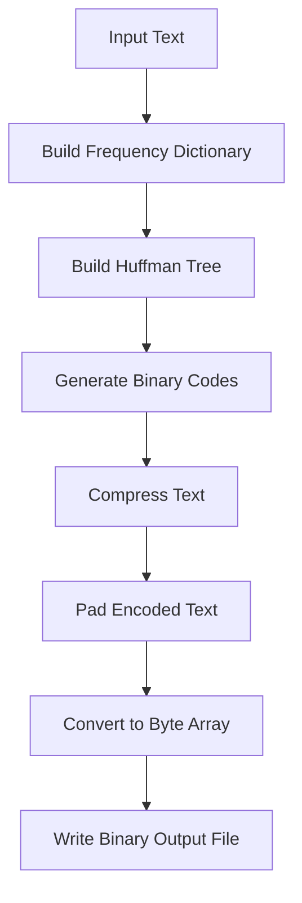

# Huffman-File-Compressor-Decompressor
This project demonstrates file compression and decompression using Huffman Coding, built with Python and Tkinter as part of the coursework for **24CAp-612**.

## Project Overview

The **Huffman File Compressor / Decompressor** is a desktop application that allows users to compress and decompress `.txt` files using Huffman Encoding, an efficient lossless data compression algorithm. The graphical interface is built using Tkinter, making it user-friendly and interactive.

## Features

- **File Compression**: Compress `.txt` files into `.bin` format using Huffman Coding.
- **File Decompression**: Restore `.bin` files back into human-readable `.txt` format.
- **Code Visualization**: Displays generated Huffman codes for each character in the file.
- **Compression Stats**: Shows original and compressed file sizes for comparison.
- **GUI Interface**: Simple and responsive interface built with Tkinter.

## Architecture

The project is structured into three main sections:

1. **Huffman Encoding Logic**: Handles frequency analysis, tree building, code generation, and compression.
2. **Decompression Logic**: Reads binary data, retrieves code mapping, and reconstructs the original text.
3. **GUI using Tkinter**: Provides buttons and dialogs for file selection, with visual display of output and Huffman codes.

### Flowchart of the Project

```mermaid
flowchart TD
    A[Start GUI] --> B[Select File to Compress]
    B --> C[Build Frequency Dictionary]
    C --> D[Build Huffman Tree]
    D --> E[Generate Huffman Codes]
    E --> F[Compress and Save Binary File]
    F --> G[Save Code Mapping (.codes)]
    G --> H[Show Compression Summary]
    H --> I[Done]

    A --> J[Select File to Decompress]
    J --> K[Load Binary and Codes]
    K --> L[Decode and Remove Padding]
    L --> M[Write Decompressed Text File]
    M --> N[Show Decompression Summary]
```

### Huffman Coding Workflow



## Conclusion

This project demonstrates practical implementation of **Huffman Coding** for lossless file compression and decompression. It also highlights how Python, along with **Tkinter**, can be used to build intuitive GUI-based tools. It can be extended further with features like drag-and-drop file selection, progress bars, and support for other file types.
